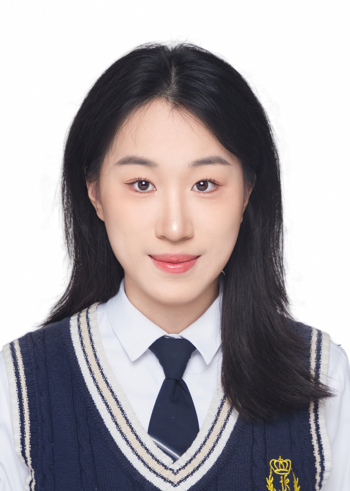

::: columns
::: {.column width="50%" style="text-align: center;"}

```{r, echo=FALSE, fig.align='center', out.width='60%'}

```

## Zihan(Teddy)Guo

:::

::: {.column .about-text width="50%" style="text-align: left;"}

`r fontawesome::fa("school")` Hi, I’m Zihan (Teddy) Guo. I’m a public health and epidemiology student who enjoys turning messy health data into clear, useful stories. I completed my B.A. in Public Health with a Biology focus at Franklin & Marshall College, and I am currently pursuing my Master of Science in Public Health in Epidemiology at Emory University.

`r fontawesome::fa("book-open")` My work focuses on epidemiologic research, clinical data analysis, and reproducible reporting. I like using tools such as R, SAS, and Python to clean data, run statistical models, create visualizations, and build interactive dashboards. I’m especially interested in roles related to epidemiology, clinical research, real-world evidence, and health analytics.

`r fontawesome::fa("bluesky")` Beyond public health, I’m also a badminton player and someone who enjoys cooking, watching shows, listening to music, and finding new places to explore.
<div class="fun-animation">🏸 📊 🎧 🍜</div>
:::